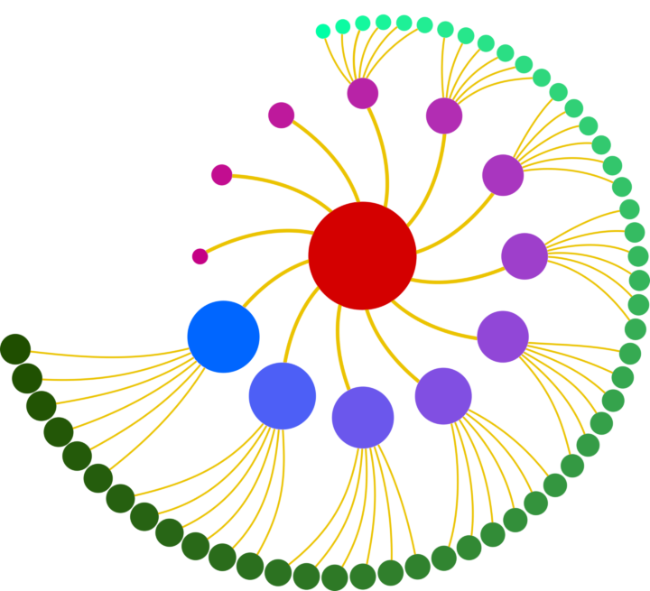

# JsAM - The JavaScript Actor Model Framework

# [](JsAMLogo.png)

[](https://github.com/k0r0pt/JsAM/actions/workflows/build.yml) [](https://www.npmjs.com/package/@k0r0pt/jsam) [](https://www.npmjs.com/package/@k0r0pt/jsam)

## Wut?

JsAM is a powerful [actor model](https://en.wikipedia.org/wiki/Actor_model) framework.

## Why?

As of the writing of this framework, while in the JVM world, we have the all powerful [Akka Framework](https://akka.io/), we have limited options with limited features in the native Javascript sphere.

Of that lack, this framework was born.

## Features

JsAM currently has these features:

* Clustering - through Leader Elections
* Stateful Actors
* Singleton Actors
* Monitoring endpoints
* Actor Communications through [gRPC](https://grpc.io)
* Actor Respawning - In case nodes go down
* Cluster Rebalancing - In case nodes are added
* [Kubernetes API](https://kubernetes.io/docs/concepts/overview/kubernetes-api/) support - So that we can deploy to Kubernetes Clusters
* Caching - For when the same big message needs to be sent to many actors. This is helpful when number of nodes is far lesser than the number of actors the message needs to be sent to, thereby saving time spent on network transfers.
* Ask Timeouts - Optional timeouts on ask operations can be specified with enviornment variable `JSAM_ASK_TIMEOUT` or as a parameter in the `ask` function.

### Planned features

* Graceful shutdown - When receiving `SIGTERM`, nodes will tell the leader nodes (or the next in line) about all the actors and their states that will go down with them.

## How?

### Install

Here's how to include this in your project:

```
npm install @k0r0pt/jsam
```

### Importing the necessary classes

```
import { ActorSystem, ActorBehavior } from '@k0r0pt/jsam';
```

or if you're on a non-ES6 project,

```
const { ActorSystem, ActorBehavior } = require('@k0r0pt/jsam');
```

### Creating the Actor System

The first step is to create the Actor System. Here's how:

```
var actorSystem = new ActorSystem('MyActorSystem', port, config);
```

### Creating the Root Actor

The Root Actor is the parent of all actors in an Actor System. This is the first thing that needs to be done as soon as the Actor System is created. Point to note, this is has a callback function which will be called once the Root Actor is created.

```
actorSystem.rootActor((err, rootActor) => {
  if (err) {
    console.log('Error while trying to create the root actor', err);
    return;
  }
  console.log('Root Actor created', rootActor);
});
```

### Creating the Actual Actors

Once the root actor is created, we can ask it to spawn children which will have behavior defining their behaviors. The Behaviors need to be specified from the root of the project.

```
await ra.spawnChild('MyActor', './path/to/MyActorBehavior.mjs');
```

## Examples

We have a few examples, which we used as case studies during the development of this framework. Those should give you a better idea of how to write applications using JsAM. The examples can be found in the [jsam-examples](https://github.com/k0r0pt/jsam-examples) repository.

A good example to start with is the classic [Ping-Pong](https://github.com/k0r0pt/jsam-examples/tree/main/ping-pong) example, wherein a messge is passed among two actors.

## Under the hood

Since we support Clustering, a number of instances (henceforth referred to as `node`s) can be deployed, which must know of each other's locations (`ip:port`) during the startup. There can be many ways this is possible. Since Node.js runs on a single thread, ideally we'd spin up muliple processes containing our JsAM Nodes on the same machine to be able take advantage of all the CPU cores.

These are the various components in JsAM:

### Actor System

The Actor System is the core component of a node. A cluster can have multiple nodes and each node will have its own Actor System. The Actor System has a bunch of sub components, which makes it all churn.

### Receptionist

Each Actor System will have its own [Receptionist](receptionist/Receptionist.mjs), wherein actor references that this node's actors communicate with, are stored. The actor references can be looked up by an Actor's locator, or by their name. Multiple Actors can have the same name as long as their hierarchy is different. This is so that we can adhere to the singleton actor pattern. The Receptionist can be accessed with `actorSystem.getReceptionist()`.

### Actor

The Actors are responsible for doing stuff. Each actor can have its own [Behavior](actor/system/ActorBehavior.mjs). Actors support two kinds of operations:

* `tell` - Where the actor can be _told_ to do something. This operation is handy when we don't expect the actor to respond with a reply.
* `ask` - Where the actor can be _asked_ to do something. This operation is handy when we do expect the actor to respond with a reply when it's done what it was asked.

In JsAM, each actor has its own messge Queue. The actors will refer to their Queues and if any messages are present in the queue, they'll dequeue it and process it based on its defined behavior. Each message will have:

* messageType
* messageBody

In a single node deployment, all actors will be present on that node.
However, in a multiple node deployment, the actual actor can only be present in one of the nodes. In this case, the other ndoes which have to communicate with an actor on a different node, will have a reference to that actor - [ActorRef](/actor/system/ActorRef.mjs).

#### Actor Hierarchy

Actors are hierarchical. Actors can have parents, and they can have children. In cluster mode, the parents and children can be on different nodes. An actor's hierarchy is represented using its locator. For example, if we have a child actor with the name `ChildActor` and its parent is `ParentActor`, its locator will be `-/ParentActor/ChildActor`.

#### Root Actor

The Root Actor is the first actor that will be created in the Actor System. This is the parent actor of all actors and Actor Systems in each node will have their own Root Actor. The locator of a Root Actor is always `-/`.

### Actor Behavior

The [Actor Behavior ](/actor/system/ActorBehavior.mjs) will determine what an actor is going to do. As an application developer, this is what needs to be defined for processing. Actor Behavior will have function callbacks based on the type of message.

## Note

All the development and case studies were run on a 12 Core 24 Thread AMD Ryzen 9 3900X processor with 50.8 GB of RAM. This is important to note in relation to the numbers (processing time and memory consumption) that follow.

The numbers will vary of course, based on the processing power and RAM capacity.

## GRPC and Streamification

All Actor creations happen through gRPC streams. This makes the process less resource intensive (except for memory) and faster. However, the ask and tell operations run on top of plain old gRPC calls.

### Why we didn't streamify ask and tell operations

We ran the processing speed with jsam case study for a million actors (1000 parent actors with 1000 child actors each), with each actor reference having a stream open to the node with the actual actor.

* Memory usage of streaming vs not streaming was huge - 32 GB vs 12 GB.
* Time of processing (processing-speed with-jsam case study) was only shaved off by a few seconds - 94 vs 88 seconds.

In conclusion, the time memory trade-off was not worth it. And the staggering number of open streams ended up using a ton of memory.